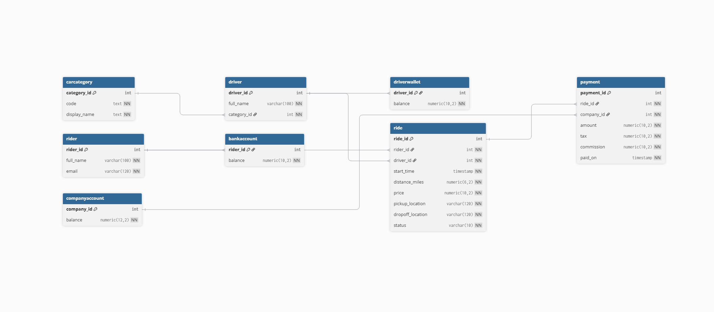
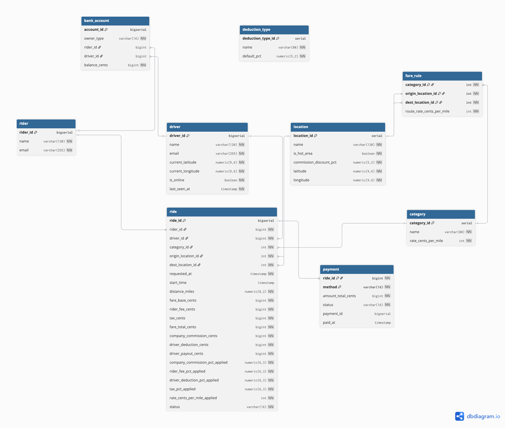

RiderBase – Database Systems Project (COSC 3380)
Team:006 - Fall 2025

1. Project Overview

RiderBase is a simplified ride-sharing platform (similar to Uber/Lyft) built for the COSC 3380 database project.
The goal is to demonstrate:
	•   Top–down database design
	•   Normalization up to BCNF
	•   Concurrent safe SQL
	•   Simulation of real operations
	•   Interactive web app using JavaScript + PostgreSQL

The system supports the three main actors:
	•   Riders – request rides, pay with card or wallet
	•   Drivers – accept rides and receive payouts
	•   Company – earns commissions, fees, and taxes

The web app allows:
Setup connection to local PostgreSQL
    •   Create tables and initialize lookup data
    •   Request rides
    •   Driver acceptance workflow
    •   Update bank accounts
    •   Ride history queries
    •   Admin tools (truncate, browse tables, simulate rides)

2. ER Modeling – Top-Down Design

    2.1 Draft Sketch (Brainstorm Phase)
    
        This sketch captures initial entity ideas:
        •	Rider
        •	Driver
        •	Location
        •	Category
        •	Ride
        •	Payment

    And early sequence logic:
        1.	Rider orders a ride
        2.	Driver accepts/rejects
        3.	Company charges rider
        4.	Company pays driver
        
    2.2 Early Structured Model (Phase 1)
    

    2.3 Final ERD (UML Notation)
    (dbdiagram.io)
    
    Key Design Notes
	•	ride links rider → driver → category → origin/dest location
	•	payment is 1:1 with each ride
	•	bank_account supports rider wallet, driver balance, and company account
	•	fare_rule supports route-based pricing overrides
	•	deduction_type makes commission rates configurable

3. Logical Model (Normalized Tables)
    All major tables were normalized up to 3NF / BCNF:

    ## Rider
    | Column | Type | Notes |
    |--------|-------|-------|
    | rider_id (PK) | BIGSERIAL | Primary key |
    | name | TEXT | Rider full name |
    | email | TEXT | Unique rider email |
    | created_at | TIMESTAMP | Defaults to NOW() |

    **Normalization:** No repeating groups, no partial or transitive dependencies → **3NF**.

    ---

    ## Driver
    | Column | Type | Notes |
    |--------|-------|-------|
    | driver_id (PK) | BIGSERIAL |
    | name | TEXT |
    | email | TEXT |
    | is_online | BOOLEAN |
    | last_seen_at | TIMESTAMP |
    | current_latitude | NUMERIC |
    | current_longitude | NUMERIC |

    **Normalization:** All attributes depend solely on driver_id → **3NF**.

    ---

    ## Location
    | Column | Type | Notes |
    |--------|-------|-------|
    | location_id (PK) | BIGSERIAL |
    | name | TEXT |
    | latitude | NUMERIC |
    | longitude | NUMERIC |
    | is_hot_area | BOOLEAN |
    | commission_discount_pct | NUMERIC |

    **Normalization:** No derived fields, no multi-valued attributes → **BCNF**.

    ---

    ## Category
    | Column | Type | Notes |
    |--------|-------|-------|
    | category_id (PK) | SERIAL |
    | name | TEXT |
    | rate_cents_per_mile | INT |

    ---

    ## Fare Rule
    | Column | Type | Notes |
    |--------|-------|-------|
    | fare_rule_id (PK) | BIGSERIAL |
    | category_id (FK) | INT → category.category_id |
    | origin_location_id (FK) | INT → location.location_id |
    | dest_location_id (FK) | INT → location.location_id |
    | route_rate_cents_per_mile | INT |

    **Normalization:** Composite dependency replaced with surrogate key + unique constraints → **BCNF**.

    ---

    ## Deduction Type
    | Column | Type | Notes |
    |--------|-------|-------|
    | deduction_type_id (PK) | SERIAL |
    | name (UNIQUE) | TEXT | e.g., 'company_commission', 'tax', etc. |
    | default_pct | NUMERIC |

    ---

    ## Ride
    | Column | Type | Notes |
    |--------|-------|-------|
    | ride_id (PK) | BIGSERIAL |
    | rider_id (FK) | BIGINT |
    | driver_id (FK) | BIGINT |
    | category_id (FK) | INT |
    | origin_location_id (FK) | INT |
    | dest_location_id (FK) | INT |
    | requested_at | TIMESTAMP |
    | start_time | TIMESTAMP |
    | status | TEXT CHECK constraint |
    | distance_miles | NUMERIC |
    | fare_base_cents | INT |
    | rider_fee_cents | INT |
    | tax_cents | INT |
    | fare_total_cents | INT |
    | company_commission_cents | INT |
    | driver_deduction_cents | INT |
    | driver_payout_cents | INT |
    | company_commission_pct_applied | NUMERIC |
    | rider_fee_pct_applied | NUMERIC |
    | driver_deduction_pct_applied | NUMERIC |
    | tax_pct_applied | NUMERIC |
    | rate_cents_per_mile_applied | INT |

    **Normalization:** Every attribute depends on full key (ride_id) → **3NF**.

    ---

    ## Payment
    | Column | Type | Notes |
    |--------|-------|-------|
    | payment_id (PK) | BIGSERIAL |
    | ride_id (FK) | BIGINT |
    | method | TEXT ('card' or 'wallet') |
    | amount_total_cents | INT |
    | status | TEXT |
    | paid_at | TIMESTAMP |

    ---

    ## Bank Account
    | Column | Type | Notes |
    |--------|-------|-------|
    | account_id (PK) | SERIAL |
    | owner_type | TEXT ('rider', 'driver', 'company') |
    | rider_id (nullable FK) | BIGINT |
    | driver_id (nullable FK) | BIGINT |
    | balance_cents | INT |

    **Normalization:** Entity-subtype structure; no transitive dependencies.

4. Physical Model (SQL)

    All SQL DDL for transaction tables (ride, payment, bank_account) is included in dt/schema.sql.

5. Transactions

    All critical modifications run inside ACID-safe transactions.

    Transaction 1 — Create Ride + Compute Fare + Insert Payment

    Stored in:
    transaction.sql

    Includes:
        •	Haversine distance
        •	Fare calculation (base, fees, tax)
        •	Commission split
        •	Insert ride
        •	Insert payment

    Transaction 2 — Driver Accepts Ride

    Stored in:
    transaction.sql

    Includes:
        •	SELECT…FOR UPDATE
        •	Wallet charge (if method = wallet)
        •	Company credit (commission + fees)
        •	Driver payout
        •	Ride state update → “accepted”

    Transaction 3 — Admin Reset (Truncate + Wallet Reset)

    Stored in:
    transaction.sql

    Wipes ride + payment and resets all balances.

6. Web App (JavaScript)

    Frontend: Next.js + Tailwind
    Backend: Next.js API routes + pg (PostgreSQL)

    Main Screens:
        •	Setup Screen – save DB credentials locally
        •	Rider Screen – request rides + view history
        •	Driver Screen – accept rides
        •	Company Screen – revenue + payouts overview
        •	Admin Screen – browse tables, truncate, simulate 50 rides

7. Simulation Feature
    We implemented:
    •   Simulate 50 Rides

    Random riders, drivers, categories, and locations.
    Runs Transaction 1 + 2 repeatedly.
    Wallet limits prevent invalid debits.

8. Query Features
    Stored in query.sql, including:
        •	Rider ride history (JOIN ride/category/location/payment)
        •	Driver earnings summary (GROUP BY)
        •	Company revenue report
        •	Bank account balances
        •	Active ride statuses

9. How to Run Locally

    1. Install PostgreSQL

    Use port 5432 and create database:
     createdb cosc3380

    2. Clone Repo
        git clone <your repo>
        cd riderbase

    3. Install dependencies
        npm install

    4. Run Dev Server
        npm run dev

    5. Open App
        Navigate to:
        🔗 http://localhost:3000

    6. Setup DB
        Enter:
            •	host: 127.0.0.1
            •	port: 5432
            •	db: cosc3380
            •	user: 
            •	password: ******